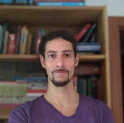

# Presentacion 

## Nombre

**Leonel Galizzi** 

 =250x250

### Sobre mi

Desde muy niñe uso computadoras, pero nunca me imaginé que me dedicaría a programar. 
Empecé varias carreras, Ing BioMédica, Filosofía. Hasta que empece a hacercarme a la programacion. Primero haciendo un curso de Java, luego entre a una empresa de tester. Luego empece la carrera. Y me fue abriendo mas puertas. Aprendiendo más a ser desarrollador. Por 7 años di clases de Física en el secundario. Tb fui ayudante en la UNSAM de AlgoII, PDP y ahora AlgoI. 
Me gusta viajar, he vivido en Rio de Janeiro, Sicilia y Barcelona. 
Me gustan los idiomas y los lenguajes de programacion =P.
Mis hobbies son la danza contemporanea, la natacion y la pintura.
